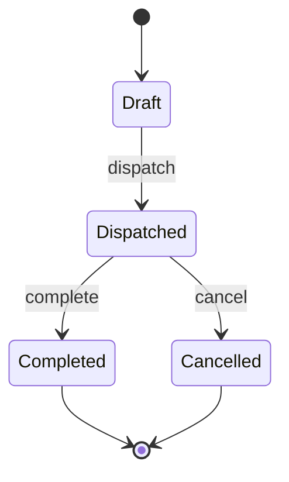
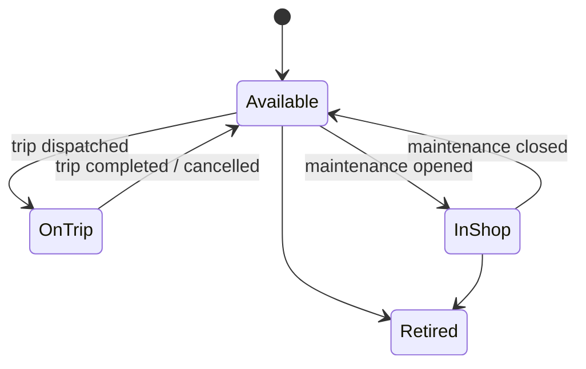
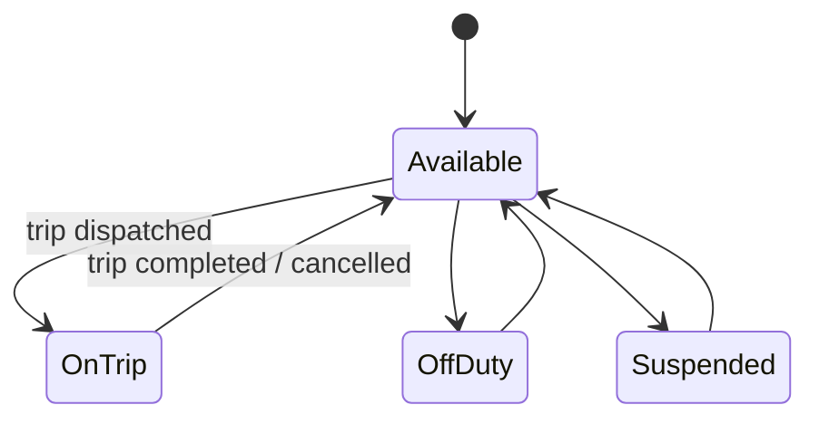

# 🚚 TransitOps

### Smart Transport Operations Platform

*Built in an 8-hour sprint for the Odoo India Hackathon*


Most transport fleets still run on spreadsheets, logbooks, and phone calls — a license quietly expires, a truck sits idle because no one updated its status, a trip's real cost shows up weeks later if at all. **TransitOps** puts vehicle, driver, trip, maintenance, and expense management into one system, enforces the rules that stop bad bookings before they happen, and gives Fleet, Safety, and Finance teams live numbers instead of end-of-month guesswork.

---

## Table of Contents
- [Overview](#overview)
- [User Roles](#user-roles)
- [Features](#features)
- [Tech Stack](#tech-stack)
- [Project Structure](#project-structure)
- [Data Model](#data-model)
- [Business Rules](#business-rules)
- [Status Lifecycles](#status-lifecycles)
- [Analytics and KPIs](#analytics-and-kpis)
- [Getting Started](#getting-started)
- [Environment Variables](#environment-variables)
- [API Overview](#api-overview)
- [Example Workflow](#example-workflow)
- [Deliverables Checklist](#deliverables-checklist)
- [Bonus Features](#bonus-features)
- [Team](#team)
- [Acknowledgments](#acknowledgments)

---

## Overview

Logistics teams running on spreadsheets hit the same problems on repeat: double-booked vehicles, drivers dispatched on expired licenses, missed maintenance, and expense numbers nobody fully trusts. TransitOps is a centralized platform covering the full lifecycle of transport operations — vehicle registration, driver management, trip dispatching, maintenance, fuel/expense logging, and reporting — with the business rules enforced by the system instead of left to memory.

## User Roles

Four roles, all behind a single RBAC-gated login:

| Role | Responsible for |
|---|---|
| **Fleet Manager** | Fleet assets, maintenance, vehicle lifecycle, operational efficiency |
| **Driver** | Creating trips, assigning vehicles/drivers, monitoring active deliveries |
| **Safety Officer** | Driver compliance, license validity, safety scores |
| **Financial Analyst** | Operational expenses, fuel consumption, maintenance costs, profitability |

## Features

| Area | What it does | Where it lives |
|---|---|---|
| 🔐 Auth & RBAC | Email/password login, role-gated views for all four roles | `pages/Auth`, `context/AuthContext.jsx` |
| 📊 Dashboard | KPI tiles, filterable by vehicle type, status, and region | `pages/Dashboard` |
| 🚐 Fleet | Vehicle registry — reg. number, type, load capacity, odometer, cost, status | `pages/Fleet` |
| 🧑‍✈️ Drivers | Driver profiles — license, expiry, contact, safety score, status | `pages/Drivers` |
| 🗺️ Trips | Create & dispatch trips, full lifecycle, validation rules | `pages/Trips` |
| 🔧 Maintenance | Log maintenance work, auto-flips vehicle status to In Shop | `pages/Maintenance` |
| ⛽ Fuel & Expenses | Fuel logs plus tolls/other costs, automatic cost rollups | `pages/FuelExpenses` |
| 📈 Analytics | Fuel efficiency, fleet utilization, operational cost, ROI, CSV export | `pages/Analytics` |

## Tech Stack

**Frontend** — `client/transitops`
- React + Vite, JavaScript/JSX
- Tailwind CSS with a shared `components/ui` kit
- React Context for auth state (`AuthContext.jsx`)
- Bun as package manager & dev runtime

**Backend** — `server`
- Bun + TypeScript
- Express-style REST API (controller → route → model)
- JWT-based auth middleware
- MongoDB for storage (swap this line if `config/db.ts` says otherwise)

**Tooling**
- ESLint on the client
- `test.rest` for API testing (REST Client)
- Scaffolded with help from Claude Code

## Project Structure

```
.
├── client/
│   └── transitops/     → React + Vite frontend
├── server/              → Bun + TypeScript backend
└── README.md
```

<details>
<summary><strong>server/</strong></summary>

```
server/
├── config/
│   └── db.ts
├── controllers/
│   ├── analytics.controller.ts
│   ├── auth.controller.ts
│   ├── driver.controller.ts
│   ├── expense.controller.ts
│   ├── maintenance.controller.ts
│   ├── trip.controller.ts
│   └── vehicle.controller.ts
├── middleware/
│   └── auth.middleware.ts
├── models/
│   └── models.ts
├── routes/
│   ├── analytics.routes.ts
│   ├── auth.routes.ts
│   ├── driver.routes.ts
│   ├── expense.routes.ts
│   ├── trip.routes.ts
│   └── vehicle.routes.ts
├── .env
├── index.ts
├── package.json
└── tsconfig.json
```

</details>

<details>
<summary><strong>client/transitops/</strong></summary>

```
client/transitops/
├── public/
│   ├── favicon.svg
│   └── icons.svg
├── src/
│   ├── assets/            → design mockups, hero image, icons
│   ├── components/
│   │   ├── Auth/
│   │   ├── dashboard/
│   │   ├── layout/
│   │   ├── ui/
│   │   └── StatusBadge.jsx
│   ├── context/
│   │   └── AuthContext.jsx
│   ├── layouts/
│   │   └── MainLayout.jsx
│   ├── pages/
│   │   ├── Analytics/
│   │   ├── Auth/
│   │   ├── Dashboard/
│   │   ├── Drivers/
│   │   ├── Fleet/
│   │   ├── FuelExpenses/
│   │   ├── Maintenance/
│   │   └── Trips/
│   ├── services/
│   ├── App.jsx
│   └── main.jsx
├── index.html
├── jsconfig.json
└── package.json
```

</details>

## Data Model

Six core entities, matching the six domains under `controllers/`:

**User** — `name`, `email` (unique), `password` (hashed), `role`

**Vehicle** — `registrationNumber` (unique), `name/model`, `type`, `maxLoadCapacity`, `odometer`, `acquisitionCost`, `status` (Available / On Trip / In Shop / Retired)

**Driver** — `name`, `licenseNumber`, `licenseCategory`, `licenseExpiryDate`, `contactNumber`, `safetyScore`, `status` (Available / On Trip / Off Duty / Suspended)

**Trip** — `source`, `destination`, `vehicle` (ref), `driver` (ref), `cargoWeight`, `plannedDistance`, `finalOdometer`, `fuelConsumed`, `status` (Draft / Dispatched / Completed / Cancelled)

**MaintenanceLog** — `vehicle` (ref), `description`, `cost`, `date`, `status` (active / closed)

**Expense** — `vehicle` (ref), `type` (Fuel / Toll / Maintenance / Other), `amount`, `liters` (if fuel), `date`

## Business Rules

Enforced by the system, not left to whoever's on shift:

- Vehicle registration numbers are unique across the fleet.
- Retired or In Shop vehicles never appear in the dispatch selection.
- Drivers with an expired license or Suspended status can't be assigned to a trip.
- A vehicle or driver already On Trip can't be double-booked.
- Cargo weight can't exceed the assigned vehicle's max load capacity.
- Dispatching a trip flips both vehicle and driver to On Trip.
- Completing a trip flips both back to Available.
- Cancelling a dispatched trip restores vehicle and driver to Available.
- Opening a maintenance record flips the vehicle to In Shop.
- Closing a maintenance record restores the vehicle to Available — unless it's Retired.

## Status Lifecycles

**Trip**



**Vehicle**



**Driver**



## Analytics and KPIs

**Dashboard tiles** — Active Vehicles, Available Vehicles, Vehicles in Maintenance, Active Trips, Pending Trips, Drivers On Duty, Fleet Utilization (%). Filterable by vehicle type, status, and region.

**Report formulas**

| Metric | Formula |
|---|---|
| Fuel Efficiency | Distance ÷ Fuel Consumed |
| Operational Cost (per vehicle) | Fuel Cost + Maintenance Cost |
| Vehicle ROI | (Revenue − (Maintenance + Fuel)) ÷ Acquisition Cost |
| Fleet Utilization (%) | Not pinned down in the brief — Vehicles On Trip ÷ Total Active Vehicles × 100 is a reasonable default |

CSV export is required; PDF export is a bonus.

## Getting Started

**Prerequisites:** [Bun](https://bun.sh) installed, plus a running database instance for whatever `server/config/db.ts` connects to.

**1. Backend**
```bash
cd server
bun install
cp .env.example .env   # fill in DB connection, JWT secret, PORT
bun run index.ts       # or `bun run dev` if a dev script is set up
```

**2. Frontend**
```bash
cd client/transitops
bun install
bun run dev
```
Vite serves the app at `http://localhost:5173` by default.

## Environment Variables

`server/.env`

| Variable | Purpose |
|---|---|
| `PORT` | Port the API runs on |
| `MONGODB_URI` | Database connection string |
| `JWT_SECRET` | Signing secret for auth tokens |
| `JWT_EXPIRES_IN` | Token lifetime *(optional)* |

## API Overview

Routes live in `server/routes/`, each wired to a matching controller:

| Route file | Handles |
|---|---|
| `auth.routes.ts` | Login / register, token issuance |
| `vehicle.routes.ts` | Vehicle CRUD, status |
| `driver.routes.ts` | Driver CRUD, license & safety score |
| `trip.routes.ts` | Trip CRUD, dispatch / complete / cancel |
| `expense.routes.ts` | Fuel logs & other expenses |
| `analytics.routes.ts` | Dashboard KPIs, reports, CSV export |

`maintenance.controller.ts` exists but didn't show a matching route file in this pass — worth wiring up or double-checking where it's mounted.

Full request/response examples live in `server/test.rest`.

## Example Workflow

1. Register vehicle **Van-05** — max capacity 500 kg, status `Available`.
2. Register driver **Alex** with a valid license.
3. Create a trip with cargo weight 450 kg.
4. System checks 450 kg ≤ 500 kg → dispatch allowed.
5. Vehicle and driver both flip to `On Trip`.
6. Complete the trip — enter final odometer and fuel consumed.
7. Vehicle and driver both flip back to `Available`.
8. Log a maintenance record (e.g. Oil Change) → vehicle flips to `In Shop`, drops out of the dispatch pool.
9. Reports update — operational cost and fuel efficiency reflect the latest trip and fuel log.

## Deliverables Checklist

Per the problem statement's mandatory list:

- [ ] Responsive web interface
- [ ] Authentication with RBAC
- [ ] CRUD for Vehicles and Drivers
- [ ] Trip Management with validations
- [ ] Automatic status transitions
- [ ] Maintenance workflow
- [ ] Fuel & Expense tracking
- [ ] Dashboard with KPIs
- [ ] Charts and visual analytics

## Bonus Features

- [ ] PDF export for reports
- [ ] Email reminders for expiring driver licenses
- [ ] Vehicle document management (RC, insurance, permits)
- [ ] Search, filters & sorting across list views
- [ ] Dark mode

## Team

- **Vaibhav Dave** — Backend+Testing
- **Om Upadhyay** — Backend
- **Ridham Shah** — Frontend
